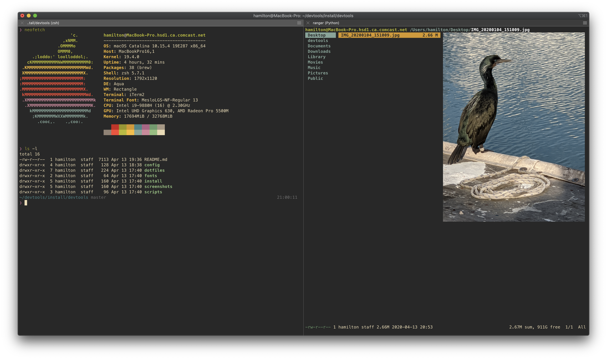
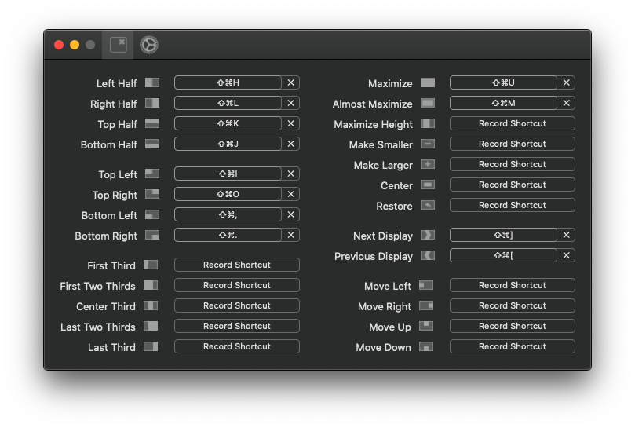
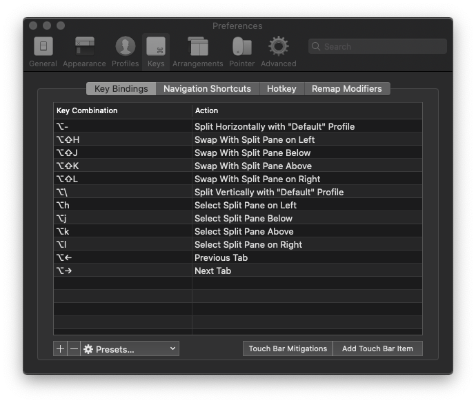
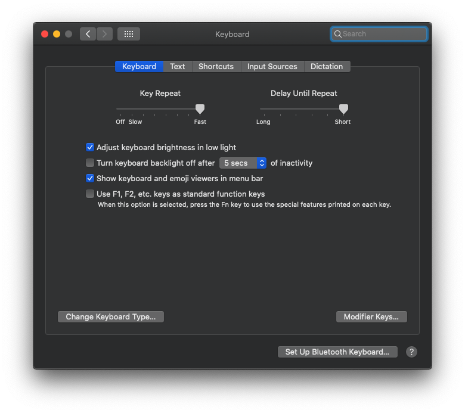
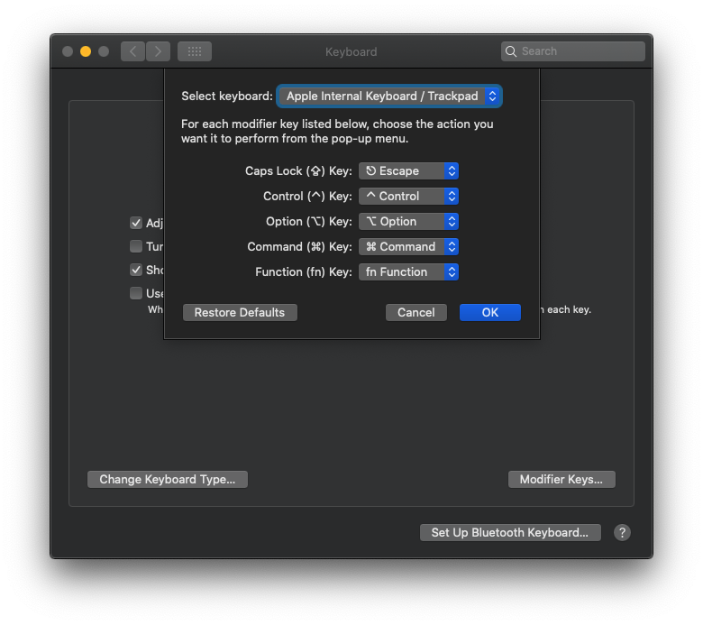
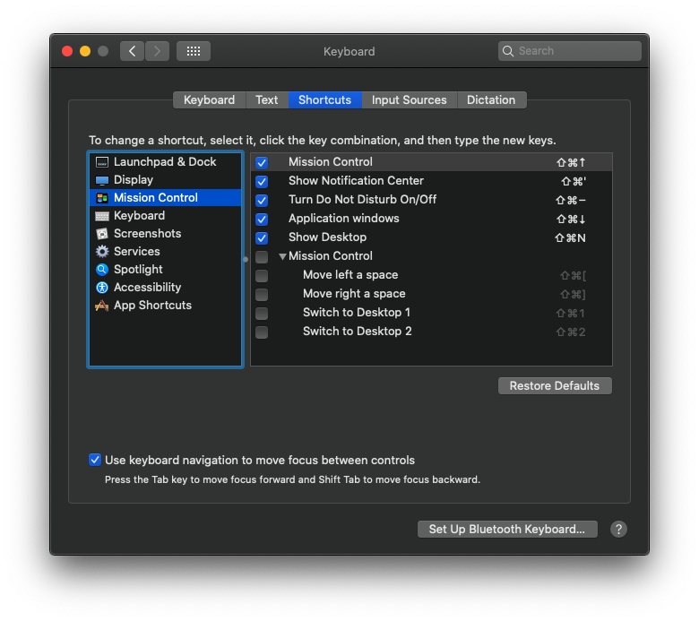
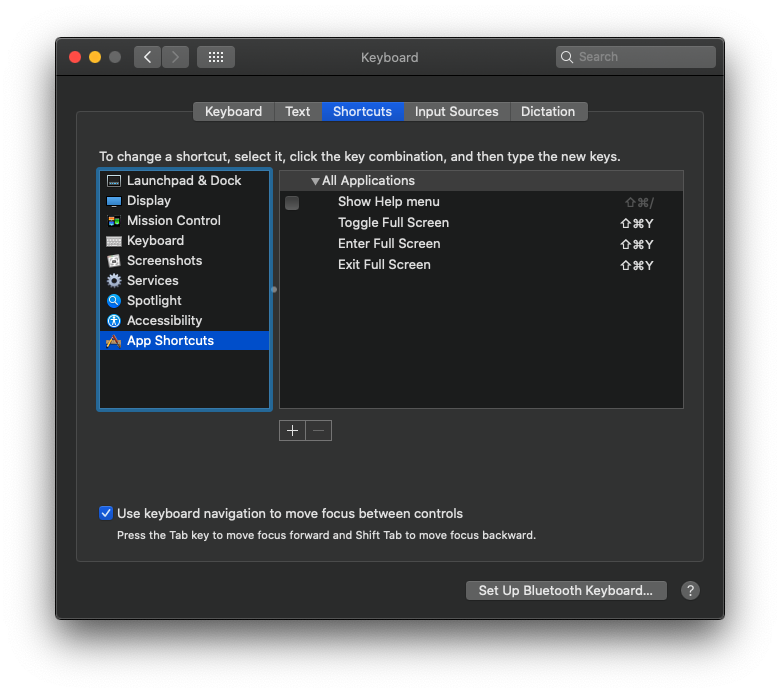

# devtools



```
cd $HOME
mkdir -p devtools/{bin,install}
```

## Applications

### Rectangle

> Move and resize windows with keyboard shortcuts.

* https://rectangleapp.com/



### iTerm2

> Default terminal application replacement.

* https://www.iterm2.com/

#### Configuration

1. Go to "Profiles > Keys" and delete all shortcuts.
2. Go to "Keys" (global) and delete all shortcuts. Then, import shortcut settings from below.
3. Edit "Split ... With Profile (null)", and use "Default" profile.

* [iTerm2 Profile](config/iterm2/iterm2_default_profile.json)
* [iTerm2 Keyboard Shortcuts](config/iterm2/iterm2_keyboard_shortcuts.itermkeymap)



#### Themes

```
git clone https://github.com/morhetz/gruvbox-contrib.git
```

### Homebrew

https://brew.sh/

```
/bin/bash -c "$(curl -fsSL https://raw.githubusercontent.com/Homebrew/install/master/install.sh)"
```

### ZSH + Oh My Zsh + Powerlevel 10k

> Get more out of your terminal.

* https://www.zsh.org/
* https://ohmyz.sh/
* https://github.com/romkatv/powerlevel10k

***Installation:***
1. Zsh.
```
apt install zsh
# or
brew install zsh
```
2. Oh My Zsh.
```
sh -c "$(curl -fsSL https://raw.github.com/ohmyzsh/ohmyzsh/master/tools/install.sh)"
```
3. Powerlevel 10k.
```
git clone --depth=1 https://github.com/romkatv/powerlevel10k.git $ZSH_CUSTOM/themes/powerlevel10k
```
```
# edit ~/.zshrc
ZSH_THEME="powerlevel10k/powerlevel10k"
```

#### Prompt

```
p10k configure
```

| Option           | Value    |
| ---              | ---      |
| Prompt           | pure     |
| Theme            | original |
| Extras           | right    |
| Time             | 24h      |
| Height           | 2 lines  |
| Spacing          | compact  |
| Transient Prompt | yes      |
| Instant Prompt   | off      |

> **NOTE: Install Meslo-Nerd font when prompted for full unicode character support. But Anonymous Pro is still a better looking font IMHO**

#### Context

I like to enable `user@host` even when I'm on my local machine. To do so, find this line and comment it out

```
# Don't show context unless root or in SSH.
# typeset -g POWERLEVEL9K_CONTEXT_{DEFAULT,SUDO}_CONTENT_EXPANSION=
```

#### Plugins

```
git clone https://github.com/zsh-users/zsh-autosuggestions ${ZSH_CUSTOM}/plugins/zsh-autosuggestions
git clone https://github.com/zsh-users/zsh-syntax-highlighting.git ${ZSH_CUSTOM}/plugins/zsh-syntax-highlighting
git clone https://github.com/zsh-users/zsh-completions ${ZSH_CUSTOM}/plugins/zsh-completions
```

```
# edit ~/.zshrc
export ZSH_AUTOSUGGEST_HIGHLIGHT_STYLE="fg=7"
plugins=(
  git
  vi-mode
  zsh-autosuggestions
  zsh-syntax-highlighting
  zsh-completions

  colorize

  docker
  docker-compose
  gcloud

  rust
  cargo

  vagrant

  # ssh-agent
)
```
> **NOTE: using `fg=7` (white) for the highlight color works well for dark and light color themes**

> **WARNING: ssh-agent will override agent-forwarding when enabled on a remote host**

#### Addendum

Add to the end of ~/.zshrc

```
################################################################################

function insert_path
{
    if [[ $# != 2 ]]; then
        return 1
    fi

    local item=$1
    local location=$2

    if [[ $PATH =~ $item ]]; then
        return 0
    fi

    case $location in
        pre)  export PATH=${item}:$PATH ; return 0 ;;
        post) export PATH=$PATH:${item} ; return 0 ;;
    esac

    return 1;
}

insert_path $HOME/devtools/bin pre

alias rng="source ranger" # drops into directory on 'q'
alias lgi="lazygit"

neofetch

################################################################################
```

### VSCode

* https://code.visualstudio.com/Download

#### Configuration

Copy `*.json` to `$HOME/Library/ApplicationSupport/Code/User`

* 
* 
* 

#### Plugins

| Plugin                                                                                                                 | Extension ID                                 |
| ---                                                                                                                    | ---                                          |
| [Align by RegEx](https://marketplace.visualstudio.com/items?itemName=janjoerke.align-by-regex)                         | janjoerke.align-by-regex                     |
| [Better Align](https://marketplace.visualstudio.com/items?itemName=wwm.better-align)                                   | wwm.better-align                             |
| [Better TOML](https://marketplace.visualstudio.com/items?itemName=bungcip.better-toml)                                 | bungcip.better-toml                          |
| [C/C++](https://marketplace.visualstudio.com/items?itemName=ms-vscode.cpptools)                                        | ms-vscode.cpptools                           |
| [CMake Tools](https://marketplace.visualstudio.com/items?itemName=ms-vscode.cmake-tools)                               | ms-vscode.cmake-tools                        |
| [CMake](https://marketplace.visualstudio.com/items?itemName=twxs.cmake)                                                | twxs.cmake                                   |
| [Docker](https://marketplace.visualstudio.com/items?itemName=ms-azuretools.vscode-docker)                              | ms-azuretools.vscode-docker                  |
| [Git Graph](https://marketplace.visualstudio.com/items?itemName=mhutchie.git-graph)                                    | mhutchie.git-graph                           |
| [Gruvbox Themes](https://marketplace.visualstudio.com/items?itemName=tomphilbin.gruvbox-themes)                        | tomphilbin.gruvbox-themes                    |
| [Python](https://marketplace.visualstudio.com/items?itemName=ms-python.python)                                         | ms-python.python                             |
| [Remote Development](https://marketplace.visualstudio.com/items?itemName=ms-vscode-remote.vscode-remote-extensionpack) | ms-vscode-remote.vscode-remote-extensionpack |
| [Rust (rls)](https://marketplace.visualstudio.com/items?itemName=rust-lang.rust)                                       | rust-lang.rust                               |
| [Vim](https://marketplace.visualstudio.com/items?itemName=vscodevim.vim)                                               | vscodevim.vim                                |
| [XML Tools](https://marketplace.visualstudio.com/items?itemName=DotJoshJohnson.xml)                                    | dotjoshjohnson.xml                           |

## Packages

### Lazygit

> TUI git client with better tools to rewrite history

```
https://github.com/jesseduffield/lazygit/releases
```

### ranger

> TUI filesystem explorer with miller-column layout and vim keybindings

```
brew install ranger
ranger --copy-config=all
```

```
# edit $HOME/.config/ranger/rc.conf
set preview_images true
set preview_images_method iterm2
```

### GNU readlink

> replace BSD `readlink` with GNU `readlink`

```
brew install coreutils
ln -s $(which greadlink) $HOME/devtools/bin/readlink
which readlink
```

> **Note: may require logout to refresh.**

### ip

> Python wrapper to emulate linux `ip` commands on Mac

```
brew install iproute2mac
```

### git

> Add aliases to ~/.gitconfig

```
[alias]
        co = checkout
        ci = commit
        st = status
        br = branch
        cp = cherry-pick
        rbi = rebase -i
        ls = log --graph --one-line --no-decorate
        ll = log --graph
        hist = log --pretty=format:\"%h %ad | %s%d [%an]\" --graph --date=short
```

## System Settings

### Keyboard

1. Set `Key Repeat` to Fast
2. Set `Delay Until Repeat` to Short
3. Remap `Caps Lock` to `Escape`
4. Configure mission control and keyboard shortcuts (see images below)






### Finder

1. "View > Show View Options" and check "Show Library Folder".
2. "Preferences > General" enable "Show these items on the desktop > Hard disks"
3. "Preferences > Sidebar" enable "Show these items in the sidebar > Locations > Hard disks"
4. "Preferences > Advanced" select "When performing a search > Search the Current Folder"
